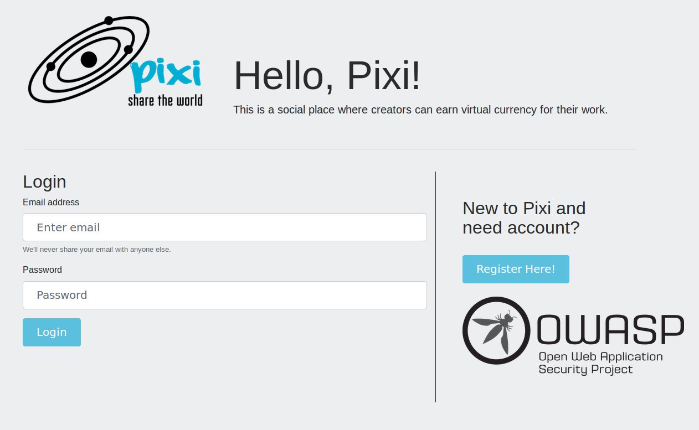

# OWASP DevSlop Project

DevSlop's Pixi, the first of many applications to come for this OWASP project, is currently publicly available for your hacking and learning pleasure. Pixi is available in several docker containers and consists of a vulnerable web app and API service.  The intent is to teach users how to test modern web applications and API's for security issues and how to write more secure API's in the future.

Read more details about the project at [https://www.owasp.org/index.php/OWASP_DevSlop_Project](https://www.owasp.org/index.php/OWASP_DevSlop_Project)


## Setup

## Pre-requisites

Setting up DevSlop's requires Docker and Docker Compose.

* [Docker](https://docs.docker.com/install/)
* [Install Docker Compose](https://docs.docker.com/compose/install/)

## Running your pixi application

* Run the following commands

```bash
$ git clone https://github.com/thedeadrobots/pixi.git
$ cd pixi
$ docker-compose up -d
```

* Navigate to [http://localhost:8000](http://localhost:8000)




## Thanks

* [Nikki Becher](https://twitter.com/thedeadrobots)
* [Tanya Janca](https://twitter.com/shehackspurple)